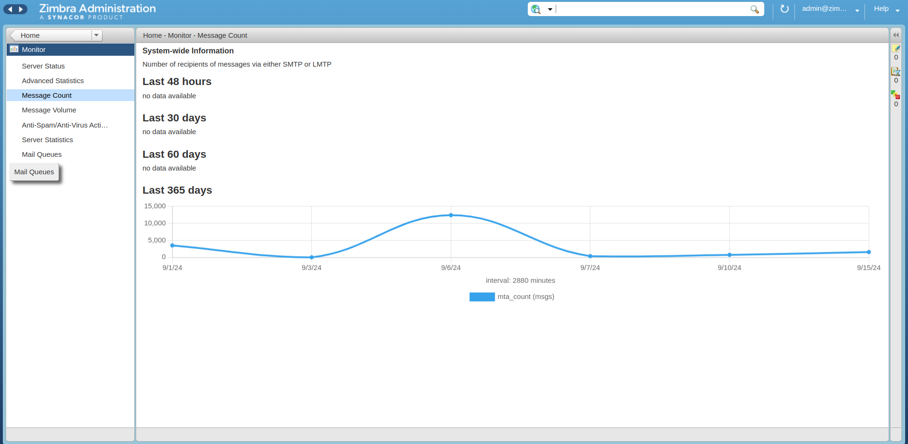
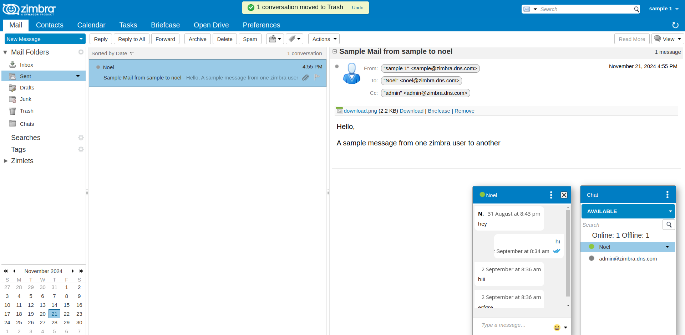
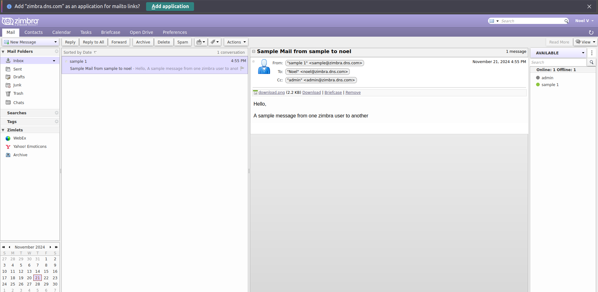
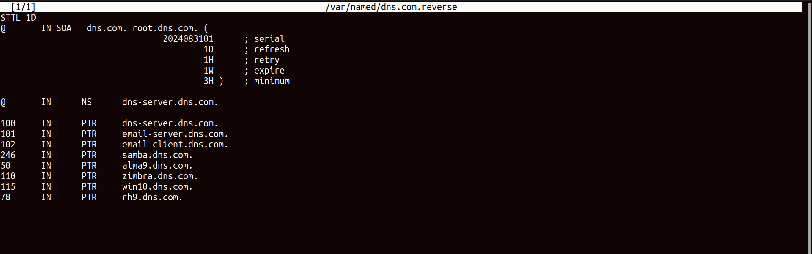
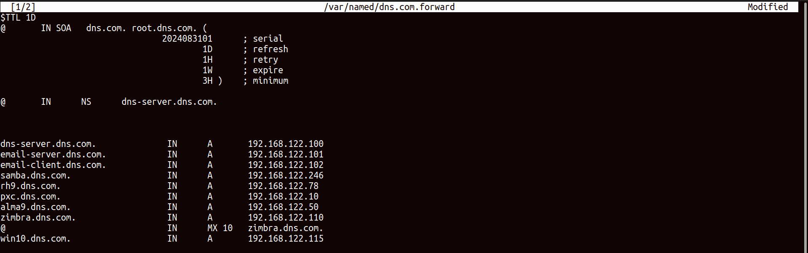
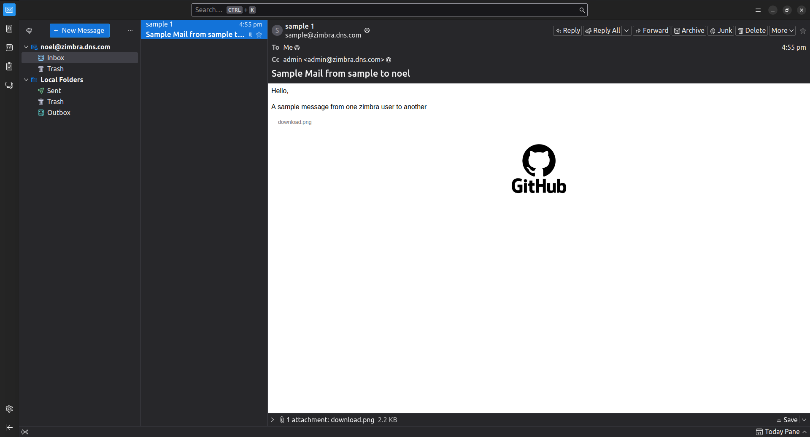

# Zimbra Mail Server and Collaboration Tool Configuration

This repository documents the successful configuration of a **Zimbra Mail Server** and its associated features, including DNS setup, MX records, and webmail functionality. The server supports sending and receiving emails via web browsers and email clients.

## Features

- **Zimbra Collaboration Suite**: Configured for seamless communication and collaboration.
- **Webmail Interface**: Send and receive emails directly from the browser.
- **DNS Integration**: Forward and reverse DNS configurations for streamlined access.
- **MX Records Setup**: Ensures efficient email delivery and routing.
- **Thunderbird Integration**: Set up for easy access via desktop email clients.

## Screenshots

### 1. Admin Panel

### 2. User 1 Panel

### 3. User 2 Panel

### 4. DNS Reverse and Forward Zones

### 5. Thunderbird Integration

### 6. Zimbra Control Plane (zmcontrol)

## Prerequisites

To replicate this setup, ensure the following:
- A Linux server (tested on Ubuntu or CentOS).
- Properly configured DNS and MX records.
- Administrative access to the server.

## Configuration Overview

1. **DNS and MX Records**:
   - Forward Zone: Configured for domain-based access.
   - Reverse Zone: Ensures proper PTR record resolution.

2. **Zimbra Installation**:
   - Installed Zimbra Collaboration Suite on the server.
   - Configured services such as LDAP, MTA, and mailbox.

3. **Webmail**:
   - Enabled webmail feature for browser-based email management.

4. **Email Client Setup**:
   - Configured Thunderbird as an example of client integration.

5. **Server Monitoring and Management**:
   - Utilized Zimbra's `zmcontrol` command for server status and management.
